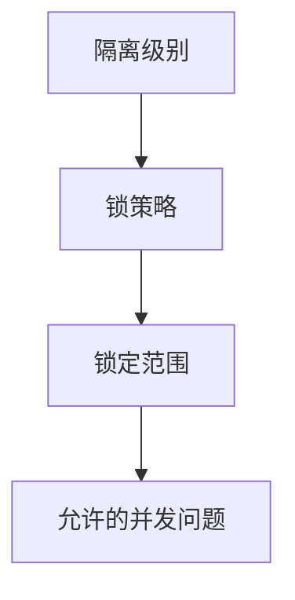

# DBS211 SQL学习笔记 (SQL Study Notes) 📚
=============================
read until p31 Chap10
Phases of Optimistic Approach
=============================
## 学习路径图 (Learning Path) 🗺️
SQL基础
├── DDL (Data Definition Language)
│ ├── CREATE
│ ├── ALTER
│ ├── DROP
│ └── TRUNCATE
├── DML (Data Manipulation Language)
│ ├── INSERT
│ ├── UPDATE
│ ├── DELETE
│ └── SELECT
└── 约束和索引
├── 主键约束
├── 外键约束
├── CHECK约束
└── 索引管理

## 目录 (Table of Contents) 📑
1. DDL语句
2. DML语句
3. 约束管理
4. 事务控制
5. 索引管理
6. 解码函数

## 1. DDL (Data Definition Language) 🟢

### CREATE TABLE (创建表) 
- 定义 | Definition
  - 用于在数据库中创建新表的SQL命令
  - SQL command used to create new tables in database
- 语法格式 | Syntax
  ```sql
  CREATE TABLE table_name (
    column1 datatype [constraints],
    column2 datatype [constraints],
    ...
    [table_level_constraints]
  );
  ```
- 示例 | Example
  ```sql
  -- 列级约束方式 | Column-level constraints
  CREATE TABLE student (
    stid number(9) primary key,
    lastname varchar(35),
    firstname varchar(35) not null,
    email varchar(45) not null unique
  );

  -- 表级约束方式 | Table-level constraints
  CREATE TABLE student (
    stid number(9),
    lastname varchar(35),
    firstname varchar(35) not null,
    email varchar(45) not null unique,
    primary key (stid)
  );
  ```
- 💡实践提示 | Practice Tips
  - 复合主键必须使用表级约束定义
  - 约束可以在列级或表级定义，但复合约束只能在表级定义

### ALTER TABLE (修改表) 🟢
- 定义 | Definition
  - 用于修改现有表结构的SQL命令
  - SQL command used to modify existing table structure
- 主要操作 | Main Operations
  1. 添加列 | Add Column
  ```sql
  ALTER TABLE table_name ADD column_name datatype [constraints];
  -- 例如 | Example:
  ALTER TABLE STUDENT ADD PHONE NUMBER(10);
  ```

  2. 修改列 | Modify Column
  ```sql
  ALTER TABLE table_name MODIFY column_name new_datatype;
  -- 例如 | Example:
  ALTER TABLE STUDENT MODIFY (LASTNAME VARCHAR2(40));
  ```

  3. 删除列 | Drop Column
  ```sql
  ALTER TABLE table_name DROP COLUMN column_name;
  ```

  4. 添加约束 | Add Constraint
  ```sql
  ALTER TABLE table_name ADD CONSTRAINT constraint_name constraint_type (column);
  -- 例如 | Example:
  ALTER TABLE STUDENT ADD CONSTRAINT STID_PK PRIMARY KEY (STID);
  ```

  5. 删除约束 | Drop Constraint
  ```sql
  ALTER TABLE table_name DROP CONSTRAINT constraint_name;
  ```

### DROP TABLE (删除表) 🟢
- 定义 | Definition
  - 用于从数据库中删除表的SQL命令
  - SQL command used to remove tables from database
- 语法 | Syntax
  ```sql
  DROP TABLE table_name;
  ```
- ⚠️注意事项 | Warnings
  - 删除表会永久删除表及其所有数据
  - 如果表被其他表引用（外键约束），需要先删除或修改引用关系

### TRUNCATE TABLE (清空表) 🟡
- 定义 | Definition
  - 用于删除表中所有记录的SQL命令
  - SQL command used to remove all records from a table
- 与DELETE的区别 | Difference from DELETE
  - TRUNCATE是DDL命令，不能回滚
  - DELETE是DML命令，可以回滚
  - TRUNCATE速度更快，因为不记录日志

## 2. DML (Data Manipulation Language) 🟢

### INSERT (插入数据) 
- 语法格式 | Syntax
  ```sql
  -- 完整插入 | Full insert
  INSERT INTO table_name VALUES (value1, value2, ...);
  
  -- 指定列插入 | Column-specific insert
  INSERT INTO table_name (column1, column2, ...) VALUES (value1, value2, ...);
  ```
- 示例 | Example
  ```sql
  -- 完整插入 | Full insert
  INSERT INTO STUDENT VALUES (123, 'Kim', 'Jane', 'Kjane', 4164567777);
  
  -- 指定列插入 | Column-specific insert
  INSERT INTO student (stid, firstname, email) 
  VALUES (127, 'Mohan', 'Mrajan');
  ```

### UPDATE (更新数据) 
- 语法格式 | Syntax
  ```sql
  UPDATE table_name
  SET column1 = value1, column2 = value2, ...
  WHERE condition;
  ```
- 示例 | Example
  ```sql
  UPDATE STUDENT 
  SET MARKS = 99 
  WHERE STID = 123;
  ```

### DELETE (删除数据)
- 语法格式 | Syntax
  ```sql
  DELETE FROM table_name
  WHERE condition;
  ```
- 示例 | Example
  ```sql
  DELETE FROM STUDENT 
  WHERE STID = 123;
  ```

## 3. 约束管理 (Constraint Management) 🟡

### 主键约束 (Primary Key)
- 定义 | Definition
  - 用于唯一标识表中的每条记录
  - Used to uniquely identify each record in a table
- 实现方式 | Implementation
  ```sql
  -- 列级约束 | Column-level
  column_name datatype PRIMARY KEY

  -- 表级约束 | Table-level
  CONSTRAINT constraint_name PRIMARY KEY (column_name)
  ```

### 外键约束 (Foreign Key)
- 定义 | Definition
  - 建立表之间的关联关系
  - Establishes relationships between tables
- 示例 | Example
  ```sql
  -- 创建时定义 | Define during creation
  COURSEID CHAR(6) REFERENCES COURSE

  -- 后续添加 | Add later
  ALTER TABLE ENROLL 
  ADD CONSTRAINT STID_FK 
  FOREIGN KEY (STID) 
  REFERENCES STUDENT(STID) 
  ON DELETE CASCADE;
  ```

### CHECK约束 (Check Constraint)
- 定义 | Definition
  - 限制列中可以存储的值的范围
  - Limits the range of values that can be stored in a column
- 示例 | Example
  ```sql
  ALTER TABLE ENROLL 
  ADD CONSTRAINT GRADE_CK 
  CHECK (GRADE IN ('A','B','C','D','F'));
  ```

## 4. 事务控制 (Transaction Control) 🟡

### 事务的属性 (Transaction Properties)
- **原子性 (Atomicity)**: 事务的所有操作必须完成，否则事务中止。
  - 例如，如果在一个事务中插入一条记录和更新另一条记录，如果其中一个操作失败，则所有操作都将被撤销。
  
- **一致性 (Consistency)**: 保证数据库从一个一致状态到另一个一致状态。
  - 例如，假设有一个银行账户转账的事务，转账前和转账后，账户的总金额应该保持不变。

- **隔离性 (Isolation)**: 事务在完成之前，其数据不能被其他事务访问。
  - 例如，两个事务同时尝试更新同一条记录，隔离性确保一个事务的更改在另一个事务完成之前不可见。

- **持久性 (Durability)**: 事务一旦提交，其更改将永久保存，不能撤销或丢失。
  - 例如，一旦银行转账事务提交，即使系统崩溃，转账的结果也会被保留。

- **可串行化 (Serializability)**: 并发执行的事务应产生与串行执行相同的结果。
  - 例如，两个事务同时对同一账户进行操作，最终结果应与这两个事务按顺序执行的结果相同。

### 示例 | Example
```sql
-- 开始事务
BEGIN;

-- 原子性示例
INSERT INTO accounts (account_id, balance) VALUES (1, 1000);
UPDATE accounts SET balance = balance - 100 WHERE account_id = 1;

-- 假设更新失败，回滚事务
IF (some_condition) THEN
    ROLLBACK;  -- 撤销所有操作
ELSE
    COMMIT;  -- 提交所有操作
END IF;
```

在这个示例中，如果更新操作失败，整个事务将被撤销，确保数据库保持一致性。

### 并发控制 (Concurrency Control)
#### 时间戳与两阶段锁结合机制 (Timestamp Ordering + 2PL) 🔄
结合时间戳机制和两阶段锁协议（2PL）可以同时保证事务的顺序性和数据一致性。

##### **1. 核心规则**
| **机制**               | **作用**                                                                 |
|------------------------|--------------------------------------------------------------------------|
| **时间戳排序**           | 为事务分配唯一时间戳（`TS`），动态验证操作顺序                                |
| **两阶段锁（2PL）**      | 通过加锁/解锁阶段（增长阶段、收缩阶段）控制并发访问                              |

##### **2. 结合方式**
1. **读操作**：
   ```sql
   -- 事务T1读取数据项D
   -- 1. 加共享锁（S-Lock）
   -- 2. 检查D的写时间戳（W-TS）：
   --    - 若 W-TS(D) > TS(T1) → 中止T1
   --    - 否则允许读取，并更新读时间戳 R-TS(D) = max(R-TS(D), TS(T1))
   ```

2. **写操作**：
   ```sql
   -- 事务T1写入数据项D
   -- 1. 加排他锁（X-Lock）
   -- 2. 检查D的读/写时间戳：
   --    - 若 R-TS(D) > TS(T1) 或 W-TS(D) > TS(T1) → 中止T1
   --    - 否则允许写入，并更新写时间戳 W-TS(D) = TS(T1)
   ```

3. **提交时**：
   - 释放所有锁（遵循2PL的解锁阶段）。
   - 更新数据项的时间戳（仅当提交成功时）。

##### **3. 示例**
```sql
-- 事务T1（TS=10）读取D
BEGIN;
LOCK TABLE data_item D IN SHARE MODE; -- 加共享锁
SELECT * FROM D;                       -- 检查W-TS(D)=5（允许读取）
UPDATE D SET R_TS = 10;               -- 更新读时间戳
COMMIT;                               -- 释放锁

-- 事务T2（TS=15）写入D
BEGIN;
LOCK TABLE data_item D IN EXCLUSIVE MODE; -- 加排他锁
SELECT * FROM D;                          -- 检查W-TS(D)=5 < 15
UPDATE D SET value = 100, W_TS = 15;      -- 允许写入
COMMIT;                                   -- 释放锁

-- 事务T1（TS=10）再次写入D（会失败）
BEGIN;
LOCK TABLE data_item D IN EXCLUSIVE MODE; -- 加排他锁
SELECT * FROM D;                          -- 检查W-TS(D)=15 > 10
ROLLBACK;                                 -- 必须中止
```

##### **4. 优势**
- **锁机制**：保证互斥访问，避免脏读/写。
- **时间戳**：动态验证事务顺序，防止旧事务覆盖新事务的修改。

### 时间戳机制缺点 (Disadvantages of Timestamping) ⚠️
- **额外存储需求 (Additional Storage Requirements)**:
  - 每个数据库值需要两个额外的时间戳字段（读时间戳R-TS和写时间戳W-TS）
  - Each database value requires two additional timestamp fields (Read-TS and Write-TS)
  ```sql
  -- 示例表结构 | Example table structure
  CREATE TABLE data_item (
    id NUMBER PRIMARY KEY,
    value VARCHAR2(50),
    r_ts NUMBER,  -- 读时间戳 | Read timestamp
    w_ts NUMBER   -- 写时间戳 | Write timestamp
  );
  ```
  - 💡 实践提示：在大型数据库中，时间戳字段可能使表大小增加20-30%

- **内存压力 (Increased Memory Needs)**:
  - 时间戳字段需要额外的存储空间
  - Timestamp fields require additional storage space
  - 对于包含百万级记录的表，可能增加数百MB的存储需求

- **处理开销 (Processing Overhead)**:
  | **操作** | **传统方式** | **时间戳机制** | 
  |---------|-------------|----------------|
  | 读取数据 | 1次I/O       | 1次I/O + 2次时间戳检查 /* 
    1. 检查事务TS ≥ W-TS（防止读取未提交的修改）
    2. 更新R-TS = max(R-TS, 当前事务TS) */
  |
  | 写入数据 | 1次I/O       | 1次I/O + 3次时间戳操作 /*
    1. 检查事务TS ≥ R-TS（防止覆盖新读取的数据）
    2. 检查事务TS ≥ W-TS（防止覆盖新写入的数据） 
    3. 更新W-TS = 当前事务TS */
    

- **系统资源消耗 (System Resource Demands)**:
  - 时间戳比较操作会增加CPU使用率
  - Timestamp comparison operations increase CPU usage
  - 在高并发场景下可能成为性能瓶颈

### 优化建议 (Optimization Tips) 💡
1. **选择性使用**：
   - 仅在需要严格顺序控制的场景使用时间戳机制
   - 例如银行交易、库存管理等关键系统

2. **字段压缩**：
   ```sql
   -- 使用复合字段存储时间戳
   CREATE TABLE optimized_data (
     id NUMBER PRIMARY KEY,
     value VARCHAR2(50),
     timestamps RAW(8)  -- 前4字节存R-TS，后4字节存W-TS
   );
   ```

3. **定期清理**：
   ```sql
   -- 归档旧数据时重置时间戳
   UPDATE historical_data 
   SET r_ts = 0, w_ts = 0 
   WHERE create_date < SYSDATE - 365;
   ```

## 5. 索引管理 (Index Management) 🔴

### CREATE INDEX (创建索引)
- 定义 | Definition
  - 创建数据库索引以提高查询性能
  - Create database index to improve query performance
- 示例 | Example
  ```sql
  CREATE INDEX cus_name_idx ON customers (customername);
  ```

### DROP INDEX (删除索引)
- 语法 | Syntax
  ```sql
  DROP INDEX index_name;
  ```

## 6. 解码函数 (Decode Function) 🔍

### DECODE (解码)
- 定义 | Definition
  - DECODE 是 Oracle SQL 中的一个函数，用于在查询中实现条件逻辑。
  - DECODE is a function in Oracle SQL used to implement conditional logic in queries.
  
- 语法格式 | Syntax
  ```sql
  DECODE(expression, search, result [, search, result]... [, default]);
  ```
  - `expression`：要比较的值。
  - `search`：要匹配的值。
  - `result`：匹配时返回的结果。
  - `default`：如果没有匹配项，则返回的默认值。

- 示例 | Example
  ```sql
  SELECT last_name,
         DECODE(SUBSTR(phone_number, 1, 3), 
                '515', 'A', 
                '590', 'B', 
                '603', 'C', 
                '650', 'D', 
                'E') AS region
  FROM employees
  ORDER BY region, phone_number;
  ```

- 💡实践提示 | Practice Tips
  - DECODE 函数可以替代简单的 CASE 语句，但在复杂条件下，使用 CASE 语句更为清晰。
  - DECODE 函数在处理多个条件时非常有用，尤其是在需要根据某个字段的值返回不同结果时。

### CASE 语句
- 定义 | Definition
  - CASE 语句是 SQL 中的条件表达式，允许在查询中实现更复杂的条件逻辑。
  - The CASE statement is a conditional expression in SQL that allows for more complex conditional logic in queries.

- 语法格式 | Syntax
  ```sql
  CASE
    WHEN condition1 THEN result1
    WHEN condition2 THEN result2
    ...
    ELSE default_result
  END
  ```

- 示例 | Example
  ```sql
  SELECT last_name,
         CASE SUBSTR(phone_number, 1, 3)
           WHEN '515' THEN 'A'
           WHEN '590' THEN 'B'
           WHEN '603' THEN 'C'
           WHEN '650' THEN 'D'
           ELSE 'E'
         END AS region
  FROM employees
  ORDER BY region, phone_number;
  ```

- 💡实践提示 | Practice Tips
  - CASE 语句比 DECODE 更灵活，支持更复杂的条件。
  - 使用 CASE 语句时，确保所有可能的条件都被考虑到，以避免意外的 NULL 值。

## 4. 并发控制 (Concurrency Control) 🟡

### 4.1 锁机制方案
### Wait/Die 和 Wound/Wait 方案
#### 1. Wait/Die 方案
- **定义**: 在此方案中，如果一个事务请求锁而被阻塞，它将根据其时间戳决定是等待还是终止。
- **规则**:
  - 如果请求锁的事务的时间戳较小（即较早），则它会等待。
  - 如果请求锁的事务的时间戳较大（即较晚），则它会被终止（"死"）。

#### 2. Wound/Wait 方案
- **定义**: 在此方案中，如果一个事务请求锁而被阻塞，它将根据其时间戳决定是等待还是被终止。
- **规则**:
  - 如果请求锁的事务的时间戳较小（即较早），则它会终止（"伤害"）正在持有锁的事务。
  - 如果请求锁的事务的时间戳较大（即较晚），则它会等待。

### 修正后的对比表格
| 请求锁的事务 | 持有锁的事务 | Wait/Die 结果          | Wound/Wait 结果        |
|--------------|---------------|------------------------|------------------------|
| T1 (100)     | T2 (200)      | T1 等待               | T2 被终止（T1抢占）    |
| T2 (200)     | T1 (100)      | T2 被终止             | T2 等待               |

**时间戳说明**：
- 较小的时间戳 = 较老的事务（older transaction）
- 较大的时间戳 = 较新的事务（younger transaction）
- 示例时间戳：T1=100（老），T2=200（新）

**规则总结**：
1. Wait/Die（等死）：
   - 老事务可以等待新事务 🔄
   - 新事务请求老事务资源 → 立即终止 💀

2. Wound/Wait（伤等）：
   - 老事务可以抢占新事务的资源 ⚔️
   - 新事务只能等待老事务完成 ⏳

### 4.2 事务隔离级别（锁视角）

#### 隔离级别与锁的对应关系


#### 锁粒度演进（以银行系统为例）
```sql
-- 账户表结构
CREATE TABLE accounts (
  acc_number VARCHAR(20) PRIMARY KEY,
  balance DECIMAL(15,2),
  last_updated TIMESTAMP
);
```

| 隔离级别       | 锁定方式          | 锁定时机         | 示例场景                 | 类比           |
|----------------|-------------------|------------------|--------------------------|----------------|
| **读未提交**   | 无锁              | 无               | 大厅显示屏（实时总资产） | 开放式书架     |
| **读已提交**   | 行级写锁（X锁）   | 写操作时         | ATM取款操作              | 图书馆单本书籍 |
| **可重复读**   | 范围锁（Gap Lock）| 读操作时         | 月度对账单生成           | 整排书架       |
| **串行化**     | 表级锁（S锁）     | 事务开始时       | 大额资金调拨             | 图书馆闭馆     |

#### 不同级别下的锁表现实验
**实验准备：**
```sql
-- 会话A
START TRANSACTION;
UPDATE accounts SET balance = 5000 WHERE acc_number = '62258801';

-- 会话B在不同隔离级别下执行：
SELECT * FROM accounts WHERE acc_number = '62258801';
```

| 隔离级别       | 会话B读取结果       | 锁状态                  | 现象解释                 |
|----------------|---------------------|-------------------------|--------------------------|
| 读未提交       | 立即返回5000        | 无锁                    | 读取到未提交数据（脏读） |
| 读已提交       | 等待会话A提交       | 行级共享锁（S锁）       | 避免脏读                 |
| 可重复读       | 返回原始值          | 范围共享锁（Gap Lock）  | 使用快照数据             |
| 串行化         | 直接报错或等待      | 表级共享锁（S锁）       | 完全隔离                 |

#### 锁类型详解
1. **行级锁（Row Lock）**
```sql
-- 显式加行锁
SELECT * FROM accounts 
WHERE acc_number = '62258801'
FOR UPDATE; -- X锁

-- 查看锁信息
SELECT * FROM V$LOCKED_OBJECT;
```

2. **间隙锁（Gap Lock）**
```sql
-- 锁定账户范围62258800-62258900
SELECT * FROM accounts
WHERE acc_number BETWEEN '62258800' AND '62258900'
LOCK IN SHARE MODE; -- S锁
```

3. **表级锁（Table Lock）**
```sql
-- 锁定整个账户表
LOCK TABLES accounts WRITE;
```

#### 工程实践建议
| 场景                | 推荐级别      | 锁机制           | 风险控制                 |
|---------------------|---------------|------------------|--------------------------|
| 实时数据展示        | 读未提交      | 无锁             | 允许0.5-1秒数据延迟      |
| 日常交易处理        | 读已提交      | 行级写锁         | 控制事务在200ms内完成    |
| 财务审计            | 可重复读      | 范围锁+MVCC      | 使用历史快照             |
| 清算结算            | 串行化        | 表级锁           | 夜间批量处理             |

#### Oracle锁监控实战
```sql
-- 查看当前锁
SELECT
  l.session_id,
  o.object_name,
  DECODE(l.locked_mode,
    2, 'Row-S (SS)',
    3, 'Row-X (SX)',
    4, 'Share',
    5, 'S/Row-X (SSX)',
    6, 'Exclusive',
    'NONE'
  ) lock_mode
FROM v$locked_object l
JOIN user_objects o ON l.object_id = o.object_id;

-- 终止阻塞会话
ALTER SYSTEM KILL SESSION 'sid,serial#';
```

## FAQ (常见问题) ❓

1. TRUNCATE和DELETE的区别？
   - TRUNCATE是DDL命令，不能回滚
   - DELETE是DML命令，可以回滚
   - TRUNCATE速度更快，因为不记录日志

2. 主键和唯一约束的区别？
   - 主键不允许NULL值，唯一约束允许NULL
   - 一个表只能有一个主键，但可以有多个唯一约束
   - 主键通常用作表的标识符

## 学习建议 (Study Tips) 💡

1. 先掌握基本的CRUD操作（增删改查）
2. 理解并熟练使用各种约束
3. 注意事务控制的使用场景
4. 多做实践，特别是复杂的表关系设计
5. 理解索引的作用和使用场景

# 数据库恢复管理与事务隔离级别

## 数据库恢复管理
- **数据库恢复**: 将数据库从某个状态恢复到之前的一致状态。
- **恢复事务**: 基于原子性事务属性，确保所有操作作为一个单一的逻辑工作单元处理。
  - 如果事务操作无法完成：
    - 事务必须被中止。
    - 数据库的更改必须回滚。

### 影响事务恢复的概念
1. **预写日志协议 (Write-Ahead Log Protocol)**:
   - 确保事务日志在数据更新之前始终被写入。

2. **冗余事务日志 (Redundant Transaction Logs)**:
   - 确保物理磁盘故障不会影响数据库管理系统（DBMS）恢复数据的能力。

3. **缓冲区 (Buffers)**:
   - 在主内存中的临时存储区域，用于提高性能。

4. **检查点 (Checkpoints)**:
   - 允许数据库管理系统将所有更新的缓冲区写入磁盘，以确保在发生故障时能够快速恢复。

## 事务隔离级别
| 隔离级别 | 允许的脏读 | 允许的不可重复读 | 允许的幻读 | 备注 |
|-----------|-------------|------------------|-------------|------|
| Read Uncommitted | 是 | 是 | 是 | 读取未提交的数据，允许脏读、不可重复读和幻读。 |
| Read Committed | 否 | 是 | 是 | 不允许读取未提交的数据，但允许不可重复读和幻读。 |
| Repeatable Read | 否 | 否 | 是 | 只允许幻读。 |
| Serializable | 否 | 否 | 否 | 不允许脏读、不可重复读或幻读。 |

### 关键概念
- **脏读 (Dirty Read)**: 读取到其他事务未提交的数据。
- **不可重复读 (Nonrepeatable Read)**: 同一事务内多次读取同一数据，结果不一致。
- **幻读 (Phantom Read)**: 同一事务内，查询条件相同但结果集不同。

### 选择建议
- 默认使用 **Read Committed** 隔离级别，平衡安全性和性能。
- 特殊情况使用 **Serializable** 隔离级别，确保数据一致性，但可能影响性能。

# 事务恢复程序中的技术

在数据库管理系统中，事务恢复是确保数据一致性和完整性的重要过程。以下是两种主要的事务恢复技术：

## 1. 延迟写技术（Deferred-write technique 或 Deferred update）
- **定义**：在这种技术中，只有事务日志被更新，而数据库本身并不立即更新。
- **优点**：
  - 提高了性能，因为数据库的写操作被延迟到事务提交时。
  - 减少了对数据库的直接写入，降低了磁盘I/O操作。
- **缺点**：
  - 如果系统崩溃，未提交的事务可能会丢失。

### 延迟写技术中的恢复过程
1. **识别最后的检查点**：在事务日志中找到最后的检查点。
2. **如果事务在最后检查点之前提交**：
   - 不需要进行任何操作，因为检查点已经将数据持久化到磁盘。
   - 事务日志中记录了该事务的提交信息，但不需要重做。
3. **如果事务在最后检查点之后提交**：
   - 必须重新执行该事务，因为检查点之后的数据可能尚未持久化。
   - 事务日志是恢复的唯一依据，包含所有必要的操作记录。
4. **如果事务在最后检查点之后有 ROLLBACK 操作**：
   - 使用事务日志回滚操作，撤销所有更改。
   - 事务日志中记录了回滚信息，确保数据一致性。

## 2. 直写技术（Write-through technique 或 Immediate update）
- **定义**：在这种技术中，数据库在事务执行期间立即更新。
- **优点**：
  - 数据库始终保持最新状态，减少了数据丢失的风险。
  - 适用于需要实时数据的应用场景。
- **缺点**：
  - 增加了磁盘I/O操作，可能会影响性能。

### 直写技术中的恢复过程
1. **识别最后的检查点**：在事务日志中找到最后的检查点。
2. **如果事务在最后检查点之前提交**：
   - 不需要进行任何操作，因为检查点已经将数据持久化到磁盘。
   - 事务日志中记录了该事务的提交信息，但不需要重做。
3. **如果事务在最后检查点之后提交**：
   - 必须重新执行该事务，因为检查点之后的数据可能尚未持久化。
   - 事务日志是恢复的唯一依据，包含所有必要的操作记录。
4. **如果事务在最后检查点之后有 ROLLBACK 操作**：
   - 使用事务日志回滚操作，撤销所有更改。
   - 事务日志中记录了回滚信息，确保数据一致性。

[End of Document]
